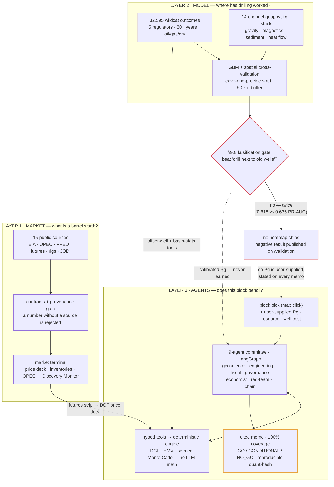

# ERDA

*The earth keeps records.*

ERDA is an upstream capital-allocation intelligence platform: a validated oil-market
terminal, a deep-learning prospectivity engine trained on 50+ years of public
exploration outcomes, and a multi-agent feasibility committee that turns a candidate
block into a cited, EMV-based investment memo.

> In Wagner's Ring, Erda is the primordial goddess who knows everything that lies
> beneath the earth. Petroleum in German is literally "Erdöl" — earth oil.

**Status:** deployable — a Bloomberg-style terminal over 15 live public sources,
a deck.gl map hero (offline basemap, 32,595 harmonized wells, block-pick →
feasibility memo), a nine-agent committee over a deterministic economics engine,
and a first-class /validation page. The prospectivity model was **honestly
stopped at the §9.8 falsification gate** — it did not beat the
distance-to-discovery baseline under spatial cross-validation, so no heatmap
ships; the map is wells + context only. See `ERDA_BUILD_SPEC.md` §14 for the
phase gates, `DEPLOY.md` to run it, and
`packages/models/cards/NEGATIVE_RESULT.md` for the gate write-up.

## Architecture — the three-layer design



The design: each layer feeds and validates the next. The futures strip becomes
the DCF price deck. The harmonized well record trains a prospectivity model
whose calibrated probability-of-success (Pg) drives the expected-monetary-value
math. A committee of specialised agents — geoscience, engineering, fiscal,
governance, economics, red-team — then assembles a cited investment memo, with
every number computed by deterministic code and every claim carrying provenance.
Market says *whether* to explore, the well record says *where has worked*, the
agents say *if it pencils*.

Two architectural rules hold throughout: **LLMs narrate, code calculates** (no
model call ever performs arithmetic — agents call typed tools, tools return
numbers), and **every persisted number carries provenance**
`{source_id, retrieved_at, source_url, transform_version}`.

A pre-registered falsification gate (§9.8) sits between Layer 2 and the map: the
model must beat a "drill next to old wells" baseline under leave-one-province-out
spatial cross-validation before any prospectivity surface ships. In the current
build the model has not cleared that bar (two attempts, documented on
/validation), so memos take user-supplied Pg — stated on every memo.

## Honest boundaries

- ERDA predicts *resemblance to historically successful acreage*, calibrated as a
  probability. It is a screening tool. It does not replace seismic, and it never
  claims "oil is here."
- Probabilities are area-level chance-of-success proxies, not prospect-level Pg from
  a mapped trap.
- Frontier hindcasts (Namibia, Guyana) are narrative case studies with small n,
  presented as such.
- Everything is public/free data, self-built, not client work.

## Layout

```
apps/api        FastAPI: REST + tiles + SSE memo stream
apps/web        Next.js terminal UI
packages/*      ingestion · contracts · geo · labels · models · engine · agents · validation
data/           raw / parquet / zarr (untracked artifacts) · curated/ (tracked, every row cited)
ops/            operational scripts; CI lives in .github/workflows/
```

## Run it locally

```
uv sync                                     # Python 3.11 workspace
cp .env.example .env                        # add free EIA + FRED keys (+ GROQ for memo prose)
uv run python ops/refresh.py                # pull the market layer → data/parquet
uv run python ops/build_labels.py           # harmonize the 5 regulators → wells DB
uv run python ops/build_stack.py            # 14-channel raster stack → data/zarr
uv run uvicorn erda_api.main:app --port 8000    # API + agents
pnpm -C apps/web dev                        # terminal UI on :3000
```

The public demo boots offline from a frozen snapshot — see `DEPLOY.md`.

## Tests & gates

```
uv run pytest                # 420 tests: engine golden case, spatial-CV harness, tools, memo determinism
uv run ruff check .          # deterministic core (engine/geo) is lint-enforced import-pure
pnpm -C apps/web test:e2e    # 8 Playwright specs incl. map interactive < 2 s
```

Every phase gate (§14) is in git history with its evidence — including the P3
commit that records the **failed** falsification gate rather than shipping a map
without demonstrated skill.
